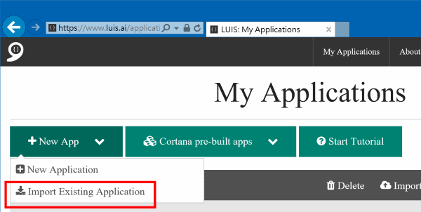
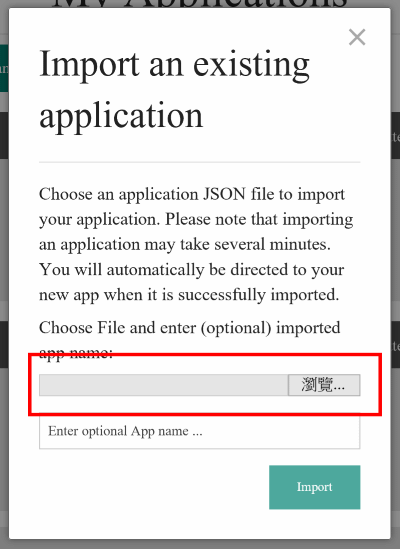

# luis-vacation-bot
使用 LUIS + Bot Framework 打造請假對談機器人，其中 [LUIS](http://luis.ai/) 負責解析語言的部份，而 [Bot Framework](https://dev.botframework.com/) 則是完成對談機器人的製作。

# LUIS 安裝說明

登入 [LUIS](http://luis.ai) 後，在 _My Applications_ 頁面，點選 _New App_ 然後選擇 **Import Existing Application**

然後在對話盒中匯入 [luis-vacation.json](luis/luis-vacation.json) 檔案、再輸入應用程式名稱，按下 **Import** 來建立請假機器人的語意模型。

# Bot 部署說明

TBD

# Code of Conduct
This project has adopted the [Microsoft Open Source Code of Conduct](https://opensource.microsoft.com/codeofconduct/). For more information see the [Code of Conduct FAQ](https://opensource.microsoft.com/codeofconduct/faq/) or contact [opencode@microsoft.com](mailto:opencode@microsoft.com) with any additional questions or comments.